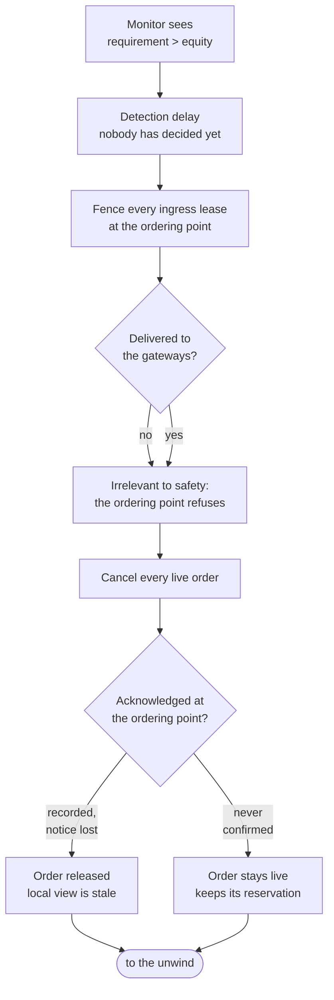
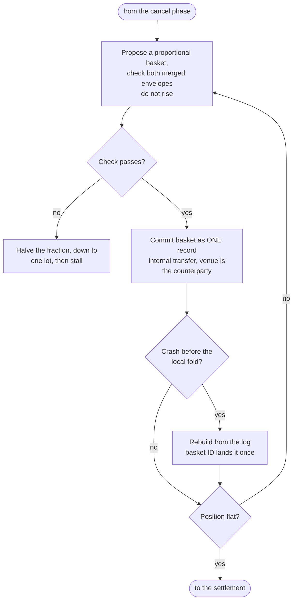
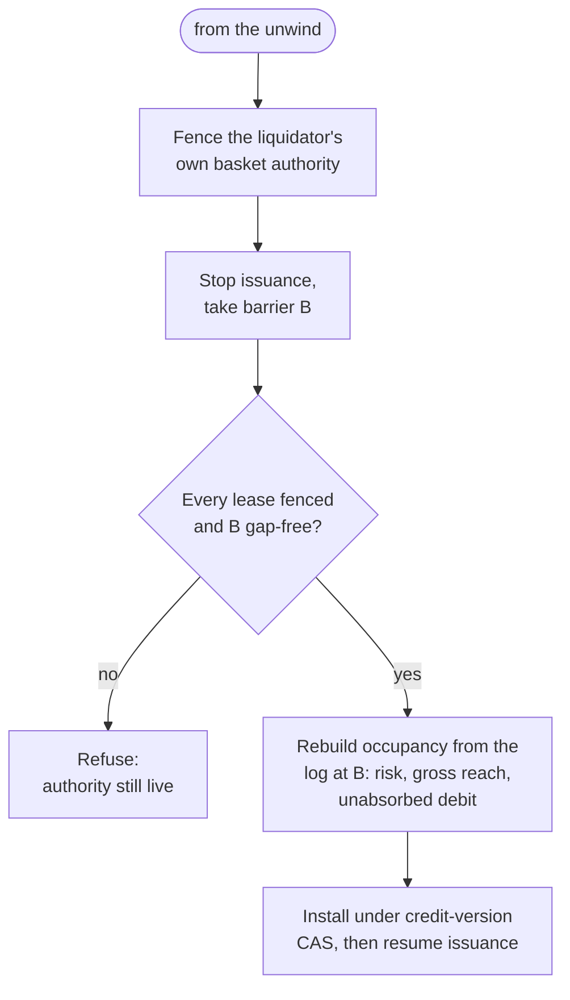

# Appendix E — Liquidation and settlement flow

The step-by-step flow behind §5.4, moved here from §2.9 to keep the body to
its page budget. E7 injects a fault at each of its three stages.

## E.1 Figure 5 — Liquidation and settlement

The path from a shortfall to capacity being returned, in three stages. E7 injects
a fault at each.

The cancel check has two labelled exits because they are two different facts
(§5.4): a cancel recorded at the ordering point releases the order, one the
matching side never confirmed does not. The barrier refuses on `no_fence` and on
a live liquidator, and E7 exercises both refusals.

