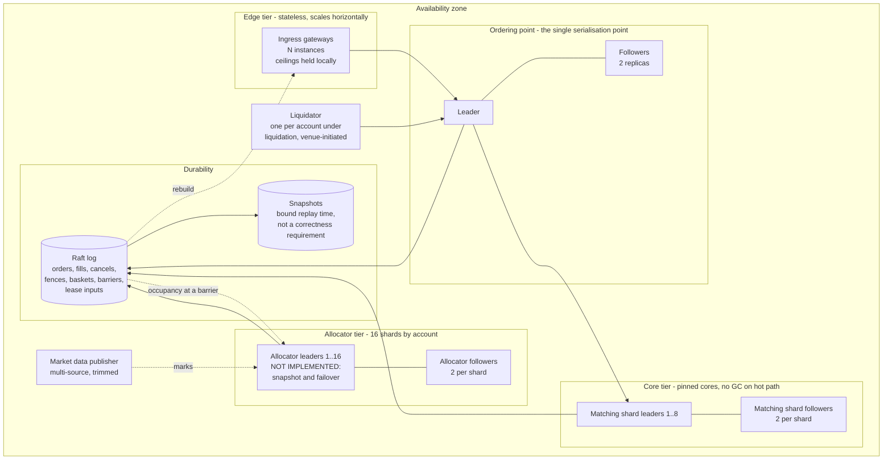

# Appendix B — Target deployment

## Figure 5 — Target deployment: designed, not built

Everything measured in this document runs in a single process against an
in-memory ordering point. This figure is the deployment the design is aimed at.
**No part of it has been implemented or measured.** It is here because the
architecture is not complete without saying where each component would live and
what replicates it, and it is in an appendix rather than the main body because a
figure of unbuilt infrastructure sitting next to measured results invites the
reader to think both have the same standing.

What the recovery evidence does support: the gateway, the account and the
settlement figure are all deterministic, idempotent folds of one ordered log,
which is the property replication needs. What it does not support: that the
replication works, that failover meets its budget, or that leader election
behaves under partition.

Three things in this picture are load-bearing and unbuilt, and they are the same
three §5.7 lists:

1. **The ordering point is replicated.** In the simulator it is one object. Every
   claim about fencing, sealing and barriers assumes it survives a node loss
   without losing or reordering the log; nothing here demonstrates that.
2. **The allocator has no snapshot or failover.** It is the only component in the
   design that cannot currently rebuild itself from the log. The credit-version
   compare-and-set in the settlement path orders competing installs; it does not
   substitute for the missing recovery work.
3. **The liquidator is drawn as venue infrastructure**, which is what makes its
   transfers internal (§5.4) and what puts it inside the trusted computing base
   (§6.1). A deployment would have to decide whether one instance serves all
   accounts or one is spawned per liquidation, and that decision is not made
   here.

Sizing figures for this tier — shard counts, snapshot sizes, replay rates — are
in §5.5 and are arithmetic, not measurements.
