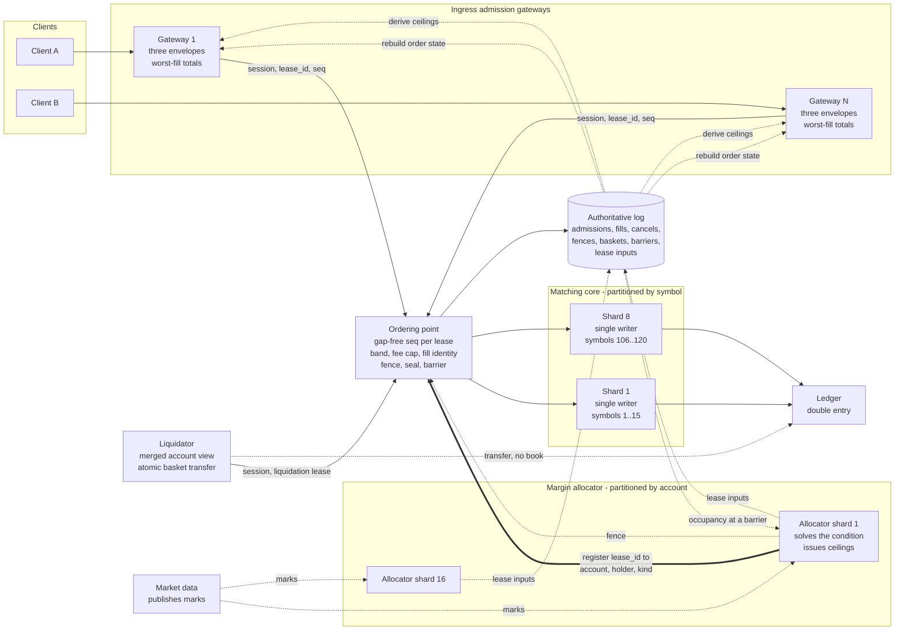
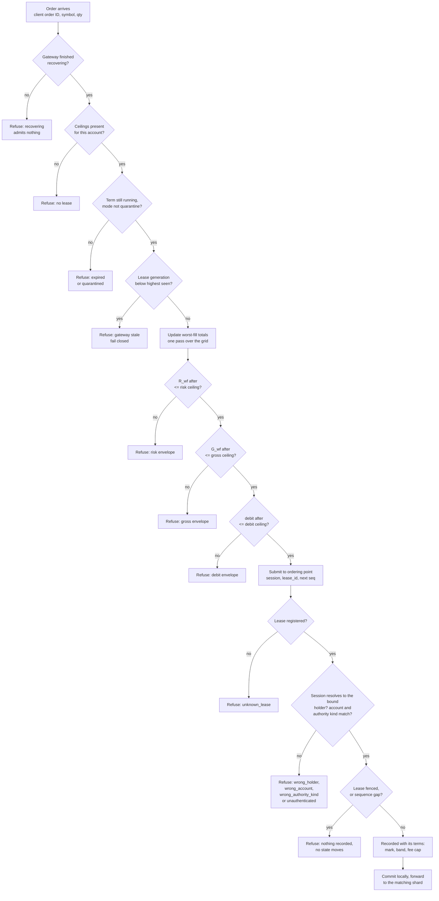
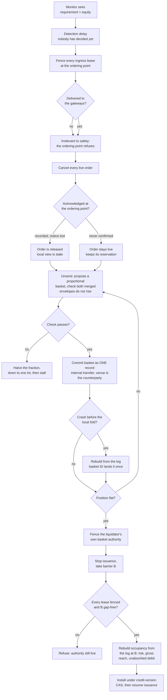
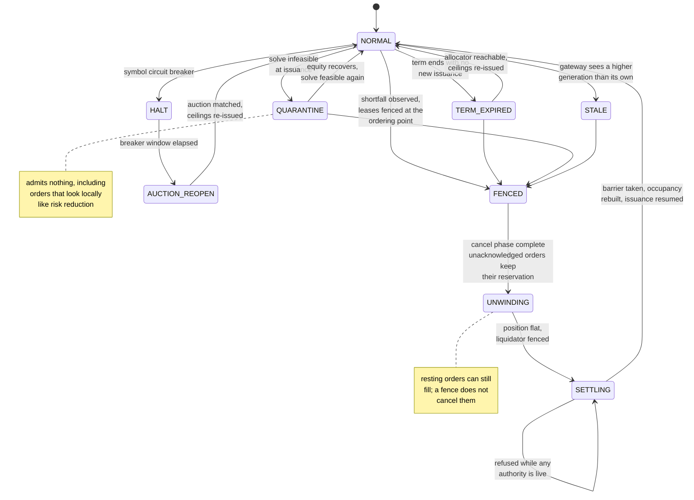

# Diagrams

Mermaid source. GitHub renders these inline; for the PDF, paste a block into
mermaid.live and export SVG (see `paper/DIAGRAM_EXPORT.md`).

---

## Figure 1 — Component view

Two authorities partitioned on different keys, and one ordering point that both
of them and every recovery path read from. Matching is partitioned by symbol
because price-time priority is a total order per book. The allocator is
partitioned by account because margin is an account-level quantity. Nothing on
the order path crosses either partition.

The liquidator is drawn apart from the gateways on purpose: it is the only holder
whose orders are checked against the merged account rather than against a
ceiling, and its transfers do not touch the order books.

Solid edges are the order path; dashed edges are asynchronous and carry no
per-order latency. The allocator never reads a gateway: every figure it acts on
comes from the log.

The thick edge is the one this design would be unsound without. A `lease_id` on
its own is a bearer token; the ordering point only knows which account, which
holder and which authority kind a lease belongs to because the allocator — the
single issuer, and therefore the only component that knows — registers the
binding. The holder on each submission is resolved from the authenticated
session, never read from the request body (§6.1, Appendix C.3).

---

## Figure 2 — Data flow for one order

Three envelope checks, all against absolute figures rather than the increment the
order adds, and then a submission the ordering point can refuse for reasons no
gateway is consulted about.

The whole per-order margin cost is the one pass at S1: the running totals are
updated per order state change rather than recomputed, so admission costs one
pass over the scenario grid however many orders are live. E3 measures that as
flat in the order count and linear in the grid width.

The boxes after `SUB` are the ordering point's, and they are the only checks here
a compromised gateway cannot influence: they use the registered binding and the
authenticated session rather than anything the request claims. Nothing downstream
re-derives S1 or the three envelope comparisons, which is what §6.1 means by the
gateway being inside the trusted computing base.

---

## Figure 3 — Liquidation and settlement

The path from a shortfall to capacity being returned. Three of the boxes are
where a fault matters, and E7 injects one at each.

The two cancel outcomes are the two different facts of §5.4, and they are why the
box has two labelled exits rather than one. The barrier refuses on `no_fence` and
on a live liquidator; E7 exercises both refusals.

---

## Figure 4 — Failure paths and the degradation ladder

Every transition is labelled with what causes it and what the venue still accepts
in that state. The state a previous version of this figure called REDUCE_ONLY has
been removed: a gateway does not accept locally-judged risk-reducing orders,
because c9 shows that judgement is unsound across gateways.

The four edges into FENCED are the four ways this design loses its authority, and
all four fail closed for new risk. Risk reduction does not happen at the gateway
in any of them; it happens on the liquidation path, which is the CAP position §3.3
defends and the correction that removed REDUCE_ONLY.

E6 measures what the FENCED-to-SETTLING path costs as a function of the detection
delay, and E7 injects a fault at each labelled box.
