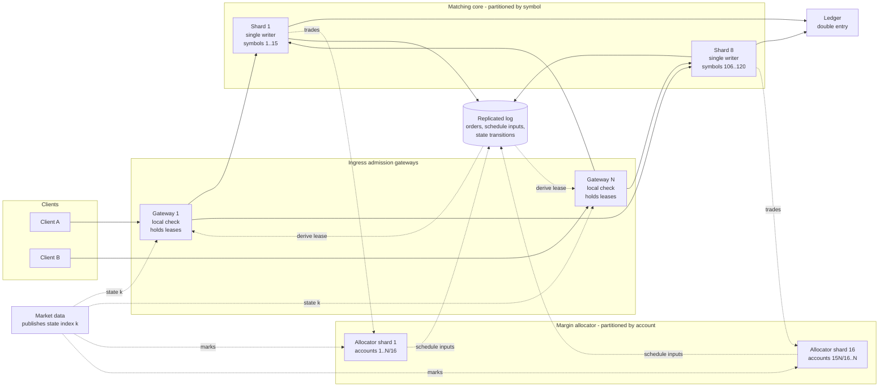
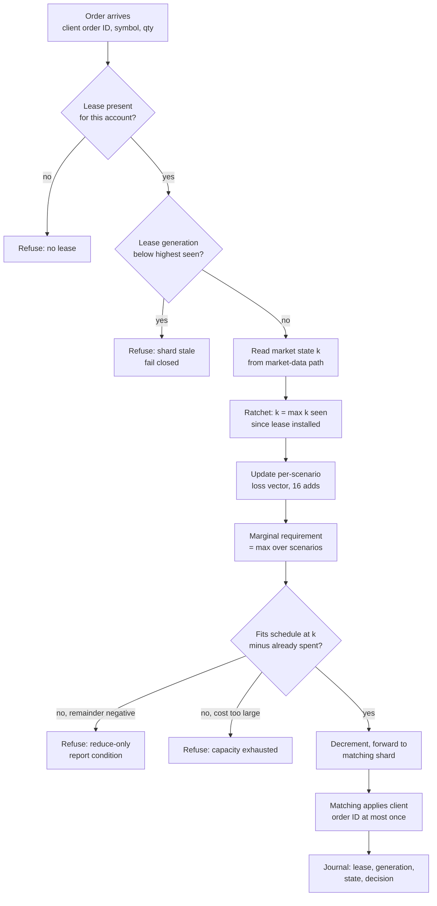
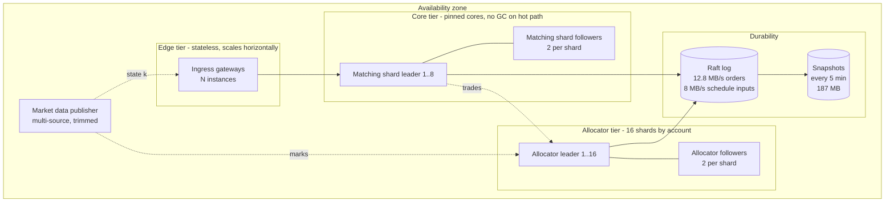
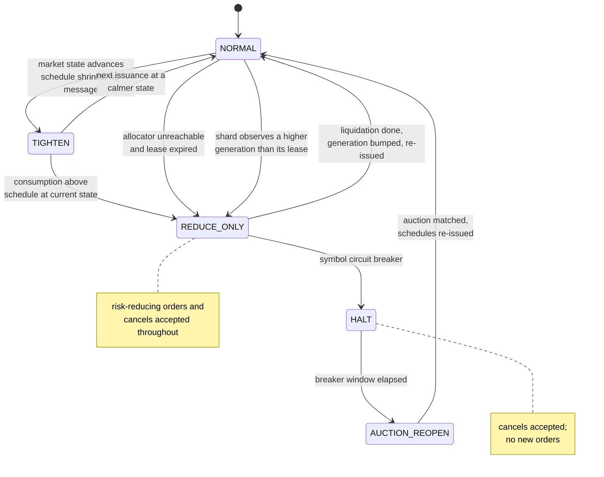

# Diagrams

Mermaid source. GitHub renders these inline; for the PDF, paste a block into
mermaid.live and export SVG (see `paper/DIAGRAM_EXPORT.md`).

---

## Figure 1 — Component view

Two authorities and two orthogonal partitionings. Matching is partitioned by
symbol because price-time priority is a total order per book. The allocator is
partitioned by account because margin is an account-level quantity. Nothing on
the order path crosses either partition.

Solid edges are the order path. Dashed edges are asynchronous and carry no
per-order latency.

---

## Figure 2 — Data flow for one order

The four inputs to an admission decision, and where each comes from. Two of
them — the lease and the market state — are the reason §5.2 puts extra records
on the log.

Steps S3 and S4 are the whole per-order cost of the margin check: sixteen
multiply-adds and sixteen comparisons, independent of how many contracts the
account holds.

---

## Figure 3 — Deployment view

Sizing from §1.6 and §5.5: 16 allocator shards at 2.5 x 10^8 scenario operations
per second each; snapshot 187 MB; cold rebuild inside 60 s at an assumed 10x
replay rate.

---

## Figure 4 — Failure paths and the degradation ladder

Every transition is labelled with what causes it and what the venue still
accepts in that state.

The three edges into REDUCE_ONLY are the three ways this design can lose its
authority: the market moved inside an epoch, the allocator became unreachable,
or the shard discovered it was stale. All three fail closed for new risk and
open for risk reduction, which is the CAP position §3 defends.

E4 measures the first edge. A scalar lease has no such edge and spends 236 of
480 ticks with the requirement above equity; the schedule spends none. E2
measures the third: with the generation rule disabled, a stale shard spends an
allowance that has been replaced and the requirement reaches 10,047 against
10,000 of equity.
