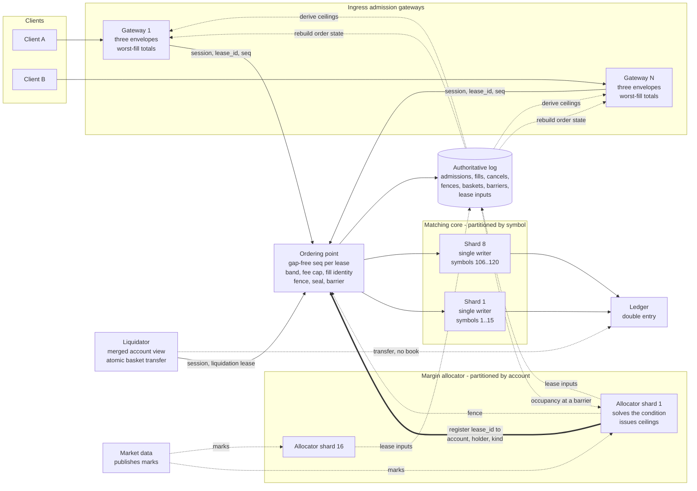
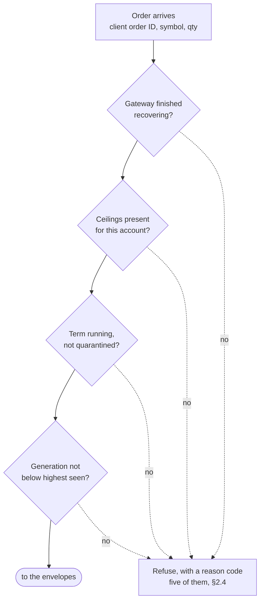
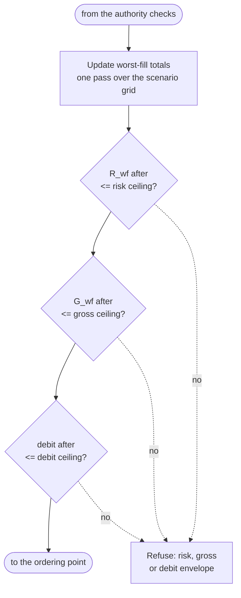
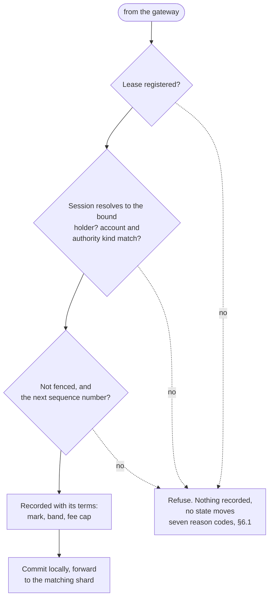
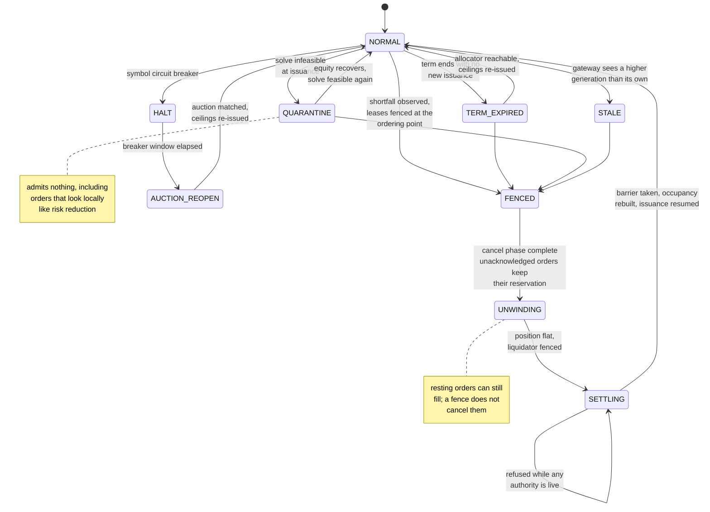
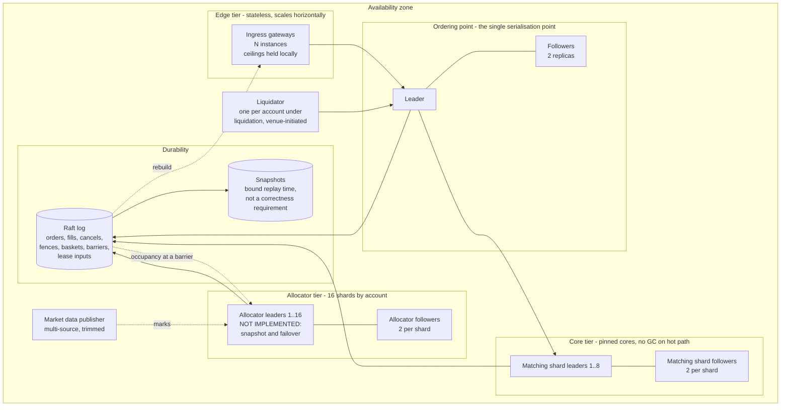

# 2.9 Architecture diagrams

The three views §2 requires — component, data flow, deployment — plus the
degradation ladder. The liquidation flow is in Appendix E. Mermaid source; `paper/DIAGRAM_EXPORT.md`
covers rendering.

---

## Figure 1 — Component view

Two authorities partitioned on different keys, and one ordering point that both
of them and every recovery path read from. The liquidator is drawn apart from the
gateways because its orders are checked against the merged account rather than a
ceiling, and its transfers do not touch the order books.

```mermaid
flowchart LR
  subgraph CL[Clients]
    C1[Client A]
    C2[Client B]
  end

  subgraph GW[Ingress admission gateways]
    G1[Gateway 1<br/>three envelopes<br/>worst-fill totals]
    G2[Gateway N<br/>three envelopes<br/>worst-fill totals]
  end

  OP[Ordering point<br/>gap-free seq per lease<br/>band, fee cap, fill identity<br/>fence, seal, barrier]

  subgraph CORE[Matching core - partitioned by symbol]
    M1[Shard 1<br/>single writer<br/>symbols 1..15]
    M2[Shard 8<br/>single writer<br/>symbols 106..120]
  end

  subgraph ALLOC[Margin allocator - partitioned by account]
    A1[Allocator shard 1<br/>solves the condition<br/>issues ceilings]
    A2[Allocator shard 16]
  end

  LQ[Liquidator<br/>merged account view<br/>atomic basket transfer]
  MD[Market data<br/>publishes marks]
  LG[(Authoritative log<br/>admissions, fills, cancels,<br/>fences, baskets, barriers,<br/>lease inputs)]
  LD[Ledger<br/>double entry]

  C1 --> G1
  C2 --> G2
  G1 -- "session, lease_id, seq" --> OP
  G2 -- "session, lease_id, seq" --> OP
  LQ -- "session, liquidation lease" --> OP
  OP --> M1
  OP --> M2
  OP --> LG
  M1 --> LD
  M2 --> LD
  LQ -. transfer, no book .-> LD
  LG -. rebuild order state .-> G1
  LG -. rebuild order state .-> G2
  LG -. occupancy at a barrier .-> A1
  MD -. marks .-> A1
  MD -. marks .-> A2
  A1 -. lease inputs .-> LG
  A2 -. lease inputs .-> LG
  LG -. derive ceilings .-> G1
  LG -. derive ceilings .-> G2
  A1 == "register lease_id to<br/>account, holder, kind" ==> OP
  A1 -. fence .-> OP
```

Solid edges are the order path; dashed edges are asynchronous. The allocator
never reads a gateway: every figure it acts on comes from the log. The thick edge
is the one this design would be unsound without — a `lease_id` alone is a bearer
token, and the ordering point knows which account, holder and authority kind it
belongs to only because the single issuer registers the binding.

---

## Figure 2 — Data flow for one order

Three stages. The first two are the gateway's and nothing downstream re-derives
them; the third is the ordering point's and a compromised gateway cannot
influence it. Refusals are collapsed to one node per stage.

```mermaid
flowchart TD
  O[Order arrives<br/>client order ID, symbol, qty] --> F0{Gateway finished<br/>recovering?}
  F0 --> F1{Ceilings present<br/>for this account?}
  F1 --> F2{Term running,<br/>not quarantined?}
  F2 --> F3{Generation not<br/>below highest seen?}
  F3 --> E([to the envelopes])
  F0 -. no .-> RA
  F1 -. no .-> RA
  F2 -. no .-> RA
  F3 -. no .-> RA[Refuse, with a reason code<br/>five of them, §2.4]
```

```mermaid
flowchart TD
  E([from the authority checks]) --> S1[Update worst-fill totals<br/>one pass over the scenario grid]
  S1 --> C1{R_wf after<br/>&lt;= risk ceiling?}
  C1 --> C2{G_wf after<br/>&lt;= gross ceiling?}
  C2 --> C3{debit after<br/>&lt;= debit ceiling?}
  C3 --> SUB([to the ordering point])
  C1 -. no .-> RB
  C2 -. no .-> RB
  C3 -. no .-> RB[Refuse: risk, gross<br/>or debit envelope]
```

```mermaid
flowchart TD
  SUB([from the gateway]) --> B1{Lease registered?}
  B1 --> B2{Session resolves to the bound<br/>holder? account and<br/>authority kind match?}
  B2 --> B3{Not fenced, and<br/>the next sequence number?}
  B3 --> A1[Recorded with its terms:<br/>mark, band, fee cap]
  A1 --> A2[Commit locally, forward<br/>to the matching shard]
  B1 -. no .-> RC
  B2 -. no .-> RC
  B3 -. no .-> RC[Refuse. Nothing recorded,<br/>no state moves<br/>seven reason codes, §6.1]
```

The whole per-order margin cost is the one pass over the scenario grid in stage
two: the running totals are updated per order state change rather than
recomputed, so admission is flat in the order count and linear in the grid width
(E3).

---

## Figure 3 — Failure paths and the degradation ladder

Every transition is labelled with what causes it and what the venue still accepts
in that state. A state a previous version called REDUCE_ONLY has been removed: a
gateway does not accept locally-judged risk-reducing orders, because c9 shows
that judgement is unsound across gateways.

```mermaid
stateDiagram-v2
    [*] --> NORMAL

    NORMAL --> TERM_EXPIRED: term ends with no<br/>new issuance
    TERM_EXPIRED --> NORMAL: allocator reachable,<br/>ceilings re-issued

    NORMAL --> QUARANTINE: solve infeasible<br/>at issuance
    NORMAL --> STALE: gateway sees a higher<br/>generation than its own
    QUARANTINE --> NORMAL: equity recovers,<br/>solve feasible again

    NORMAL --> FENCED: shortfall observed,<br/>leases fenced at the<br/>ordering point
    TERM_EXPIRED --> FENCED
    QUARANTINE --> FENCED
    STALE --> FENCED

    FENCED --> UNWINDING: cancel phase complete<br/>unacknowledged orders keep<br/>their reservation
    UNWINDING --> SETTLING: position flat,<br/>liquidator fenced
    SETTLING --> NORMAL: barrier taken, occupancy<br/>rebuilt, issuance resumed
    SETTLING --> SETTLING: refused while any<br/>authority is live

    NORMAL --> HALT: symbol circuit breaker
    HALT --> AUCTION_REOPEN: breaker window elapsed
    AUCTION_REOPEN --> NORMAL: auction matched,<br/>ceilings re-issued

    note right of QUARANTINE
      admits nothing, including
      orders that look locally
      like risk reduction
    end note

    note right of UNWINDING
      resting orders can still
      fill; a fence does not
      cancel them
    end note
```

The four edges into FENCED are the four ways this design loses authority, and all
four fail closed for new risk. Risk reduction happens on the liquidation path in
every one of them, which is the CAP position §3.3 defends and the correction that
removed REDUCE_ONLY.

---

## Figure 4 — Deployment view: target, not built

Everything measured in this document runs in a single process against an
in-memory ordering point. **No part of this figure has been implemented or
measured.** It is drawn because the architecture is not complete without saying
where each component lives and what replicates it, and it is labelled because a
diagram of unbuilt infrastructure next to measured results otherwise invites the
reader to give both the same standing.

```mermaid
flowchart TB
  subgraph AZ[Availability zone]
    subgraph EDGE[Edge tier - stateless, scales horizontally]
      GWX[Ingress gateways<br/>N instances<br/>ceilings held locally]
    end

    subgraph OPZ[Ordering point - the single serialisation point]
      OPL[Leader]
      OPF[Followers<br/>2 replicas]
    end

    subgraph COREZ[Core tier - pinned cores, no GC on hot path]
      MS1[Matching shard leaders 1..8]
      MSR[Matching shard followers<br/>2 per shard]
    end

    subgraph ALLOCZ[Allocator tier - 16 shards by account]
      AL1[Allocator leaders 1..16<br/>NOT IMPLEMENTED:<br/>snapshot and failover]
      ALR[Allocator followers<br/>2 per shard]
    end

    LQZ[Liquidator<br/>one per account under<br/>liquidation, venue-initiated]

    subgraph DATA[Durability]
      RL[(Raft log<br/>orders, fills, cancels,<br/>fences, baskets, barriers,<br/>lease inputs)]
      SN[(Snapshots<br/>bound replay time,<br/>not a correctness requirement)]
    end

    MDP[Market data publisher<br/>multi-source, trimmed]
  end

  GWX --> OPL
  LQZ --> OPL
  OPL --- OPF
  OPL --> MS1
  MS1 --- MSR
  AL1 --- ALR
  OPL --> RL
  MS1 --> RL
  AL1 --> RL
  RL --> SN
  RL -. rebuild .-> GWX
  RL -. occupancy at a barrier .-> AL1
  MDP -. marks .-> AL1
```

Three things here are load-bearing and unbuilt, and they are the three §5.7
lists. The ordering point is replicated, and every claim about fencing, sealing
and barriers assumes it survives a node loss without losing or reordering the
log. The allocator has no snapshot or failover: it is the only component that
cannot rebuild itself from the log. And the liquidator is venue infrastructure,
which is what makes its transfers internal (§5.4) and what puts it inside the
trusted computing base (§6.1).

What the recovery evidence supports is the property replication needs — each
component's state is a deterministic, idempotent fold of one ordered log — and
not that the replication works.
